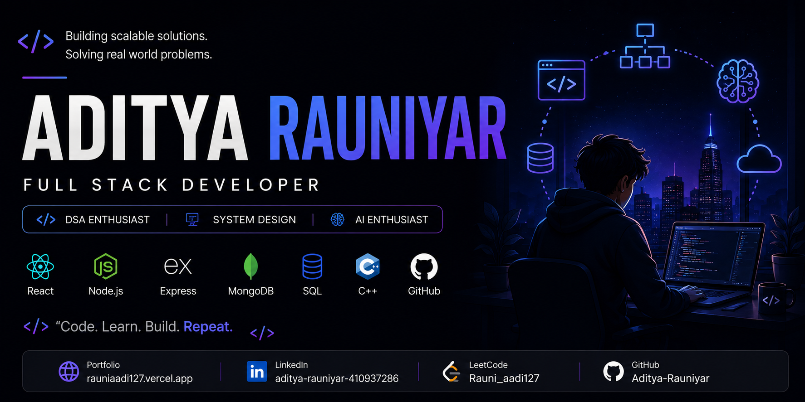

<!-- ========================= BANNER ========================= -->

  

<h1 align="center">Hi 👋, I'm Aditya Rauniyar</h1>

<h3 align="center">
Full Stack Developer • DSA Enthusiast • System Design
</h3>

Building scalable web applications • Solving algorithmic problems • Exploring backend engineering & AI

---

# 👨‍💻 About Me

🎓 B.Tech CS @ KIET Group of Institutions

💻 Full Stack Web Developer

🧠 Strong foundation in Data Structures & Algorithms

🏆 Qualified GATE 2026 (Computer Science & Information Technology)

📚 Proficient in

- Database Management Systems
- SQL
- Operating Systems
- Computer Networks
- Object-Oriented Programming

⚙️ Currently learning

- System Design
- Scalable Backend Architectures
- Distributed Systems

🤖 Interested in AI-powered products that solve real-world problems.

---

# 🚀 Tech Stack

### Languages

---

### Frontend

---

### Backend

---

### Authentication & Real-Time

- 🔐 Clerk Authentication

- ⚡ Inngest

- 🎥 Stream Video & Chat

---

### Tools

---

# 🌟 Featured Projects

## 💻 CodeRoom

A collaborative coding platform for technical interviews featuring real-time code editing, video calls, live chat, and secure coding rooms.

**Tech:** React • Node.js • Express • MongoDB • Clerk • Stream • Inngest

---

## 🩺 SehatVani

An AI-powered healthcare platform that simplifies blood reports into easy-to-understand insights using Google Gemini.

**Tech:** React • Node.js • Express • MongoDB • Gemini AI

---

## 🌍 Carbon Footprint Tracker

A sustainability platform that tracks carbon emissions and recommends eco-friendly meal plans.

**Tech:** Python • Flask • PostgreSQL • JavaScript

---

# 🔥 GitHub Streak

---

# 📈 Contribution Graph

---

# 🏅 Achievements

- 💻 Solved **700+ DSA problems** across LeetCode, GeeksforGeeks, and CodeChef.
- 🏆 Qualified GATE 2026 (Computer Science & Information Technology)
- 🚀 Top 4 Finalist - SprintHack 3.0
- 🌱 Built multiple AI-powered and full-stack web applications.

# 💻 Coding Profiles

---

# 🌐 Connect With Me

---

# 💭 Quote

> *"First, solve the problem. Then, design it to scale."*

---

⭐ **Thanks for visiting my profile! If you like my work, consider giving a ⭐ to my repositories.**
